# Getting to Know `asyncio`

<div dir="rtl">
<style>
    pre {
        direction: ltr;
    }
</style>

يتناول هذا الفصل:

- **ما هو `asyncio` والفوائد التي يوفرها**
- **التزامن (Concurrency) والتوازي (Parallelism) و (Threads) والعمليات (Processes)**
- **(Global Interpreter Lock) والتحديات التي يفرضها على التزامن**
- **كيف يمكن تحقيق التزامن باستخدام thread واحد فقط مع sockets غير المحظورة (Non-blocking sockets)**
- **أساسيات كيفية عمل التزامن القائم على الحلقة الحدثية (Event-loop-based concurrency)**


---

🌐 **تطبيقات الويب والعمليات غير المتزامنة**

تعتمد العديد من التطبيقات، وخاصة في عالم تطبيقات الويب اليوم، بشكل كبير على **عمليات الإدخال/الإخراج (I/O)**. تشمل هذه العمليات:

- تنزيل محتويات صفحة ويب من الإنترنت 🌍
- التواصل عبر الشبكة مع مجموعة من خدمات **الميكروسيرفيس** ☁️
- تشغيل عدة استعلامات معًا على قاعدة بيانات مثل **MySQL** أو **Postgres** 🗄️

### التحديات في عمليات الإدخال/الإخراج

قد تستغرق طلبات الويب أو الاتصالات مع خدمة ميكروسيرفيس مئات الميلي ثانية، أو حتى ثوانٍ إذا كانت الشبكة بطيئة. يمكن أن يكون الاستعلام عن قاعدة بيانات مستهلكًا للوقت، خاصة إذا كانت قاعدة البيانات تحت حمل عالٍ أو كان الاستعلام معقدًا. قد يحتاج خادم الويب إلى التعامل مع مئات أو آلاف الطلبات في نفس الوقت.

### مشكلة الأداء

إجراء العديد من طلبات الإدخال/الإخراج (I/O) مرة واحدة يمكن أن يؤدي إلى مشاكل كبيرة في الأداء. إذا قمنا بتشغيل هذه الطلبات واحدًا تلو الآخر كما نفعل في تطبيق يعمل بشكل تسلسلي، فسوف نرى تأثيرًا متزايدًا على الأداء. 

💡 **مثال توضيحي**:
- إذا كنا نكتب تطبيقًا يحتاج إلى تنزيل 100 صفحة ويب أو تشغيل 100 استعلام، كل منها يستغرق ثانية واحدة للتنفيذ، فسيستغرق تطبيقنا على الأقل 100 ثانية للتشغيل.
- ومع ذلك، إذا استغلينا **التزامن (concurrency)** وبدأنا التنزيلات وانتظرنا في الوقت نفسه، نظريًا، يمكننا إكمال هذه العمليات في أقل من ثانية واحدة! ⏱️
إليك النص المعدل باستخدام المصطلح الإنجليزي "thread":

---

✨ **مكتبة `asyncio` في بايثون**

تم تقديم مكتبة `asyncio` لأول مرة في **Python 3.4** كطريقة إضافية للتعامل مع الأحمال الكبيرة المتزامنة (concurrent) خارج إطار **تعدد threads (multithreading)** و**تعدد العمليات (multiprocessing)**. 

🚀 **فوائد `asyncio`**:
- يمكن أن يؤدي الاستخدام الصحيح لهذه المكتبة إلى تحسينات كبيرة في الأداء واستخدام الموارد للتطبيقات التي تعتمد على عمليات الإدخال/الإخراج.
- تتيح لنا بدء العديد من المهام الطويلة التشغيل معًا.

### أهداف الفصل
في هذا الفصل، سنقدم أساسيات التزامن لفهم كيفية تحقيقه باستخدام بايثون ومكتبة `asyncio`. سنستكشف الفروقات بين:

- **العمل المرتبط بوحدة المعالجة المركزية (CPU-bound work)** 🖥️
- **العمل المرتبط بالإدخال/الإخراج (I/O-bound work)** 📡

سنفهم أي نموذج تزامن يناسب احتياجاتنا الخاصة. 

### المحتوى الذي سنتناوله:
- التعرف على أساسيات العمليات وthreads والتحديات الفريدة التي يفرضها **Global Interpreter Lock (GIL)** على التزامن في بايثون.
- فهم كيفية استخدام مفهوم **الإدخال/الإخراج غير المحجوب (non-blocking I/O)** مع **حلقة الأحداث (event loop)** لتحقيق التزامن باستخدام عملية واحدة وthread واحد فقط في بايثون. 

هذا هو نموذج **التزامن الرئيسي** لمكتبة `asyncio`! 🌀
إليك النص المنظم مع إضافة الرموز التعبيرية:

---


## ما هو `asyncio`؟

في **التطبيقات المتزامنة (synchronous application)**، يتم تشغيل الكود بالتسلسل. يتم تنفيذ السطر التالي من الكود بمجرد أن ينتهي السطر السابق، ولا يحدث سوى شيء واحد في وقت واحد. 

🤔 **التحديات في هذا النموذج**:
- هذا النموذج يعمل بشكل جيد للعديد من التطبيقات، إن لم يكن معظمها. 
- ولكن ماذا لو كان هناك سطر من الكود بطيء بشكل خاص؟ 

في هذه الحالة، سيظل باقي الكود بعد هذا السطر البطيء معلقًا في انتظار إكماله. يمكن أن تمنع هذه الأسطر البطيئة المحتملة التطبيق من تشغيل أي كود آخر.

🔄 **مثال على المشكلة**:
ربما رأينا هذا من قبل في واجهات المستخدم التي تحتوي على أخطاء، حيث نضغط بسعادة هنا وهناك حتى يتجمد التطبيق، مما يتركنا مع دائرة انتظار (spinner) أو واجهة غير مستجيبة. 


🚫 **هذا مثال على تطبيق يتوقف عن العمل، مما يؤدي إلى تجربة مستخدم سيئة**.


إليك النص المنظم مع إضافة الرموز التعبيرية:

---

## التحديات في التطبيقات المتزامنة

بينما يمكن لأي عملية أن تتسبب في توقف التطبيق إذا استغرقت وقتًا طويلاً، فإن العديد من التطبيقات ستتوقف في انتظار عمليات **الإدخال/الإخراج (I/O)**. 

💻 **ما هو الإدخال/الإخراج؟**
- يشير الإدخال/الإخراج إلى أجهزة إدخال وإخراج الكمبيوتر مثل لوحة المفاتيح، القرص الصلب، والأكثر شيوعًا، بطاقة الشبكة.
- تنتظر هذه العمليات إدخال المستخدم أو استرجاع المحتويات من واجهة برمجة تطبيقات (API) تعتمد على الويب.

في **التطبيقات المتزامنة (synchronous application)**، سنظل عالقين في انتظار إكمال هذه العمليات قبل أن نتمكن من تشغيل أي شيء آخر. يمكن أن يتسبب ذلك في مشاكل في الأداء والاستجابة، حيث لا يمكننا تشغيل سوى عملية طويلة واحدة في أي وقت معين، وهذه العملية ستوقف تطبيقنا عن القيام بأي شيء آخر.

## الحل: التزامن (Concurrency)

أحد الحلول لهذه المشكلة هو إدخال مفهوم **التزامن (Concurrency)**. ببساطة، يعني التزامن السماح بتنفيذ أكثر من مهمة في نفس الوقت. يمكن أن يكون ذلك من خلال تنفيذ عدة عمليات في نفس الوقت أو السماح باتصالات متعددة بخادم الويب في نفس الوقت.

#### كيفية تحقيق التزامن في بايثون

هناك عدة طرق لتحقيق هذا التزامن في بايثون. واحدة من أحدث الإضافات إلى نظام بايثون هي مكتبة **`asyncio`**. تشير `asyncio` إلى **الإدخال/الإخراج غير المتزامن (asynchronous I/O)**. 

🌟 **فوائد مكتبة `asyncio`**:
- تتيح لنا تشغيل الكود باستخدام نموذج البرمجة **التزامن**.
- تسمح لنا بالتعامل مع عمليات إدخال/إخراج متعددة في آن واحد، بينما يبقى التطبيق مستجيبًا.

## ما هي البرمجة غير المتزامنة (asynchronous I/O)؟

تعني أن مهمة معينة طويلة الأمد يمكن تشغيلها في الخلفية بشكل منفصل عن التطبيق الرئيسي. بدلاً من أن يمنع التطبيق من تنفيذ أي كود آخر أثناء انتظار اكتمال تلك المهمة الطويلة، يكون النظام حرًا في القيام بأعمال أخرى لا تعتمد على تلك المهمة. 

✅ **عند اكتمال المهمة الطويلة**، سنُخطَر بأن المهمة قد انتهت حتى نتمكن من معالجة النتيجة.

إليك النص المنظم مع إضافة الرموز التعبيرية وصورة الشكل:

---

## التوازي (Parallelism)

بينما يشير **التزامن (Concurrency)** إلى أن هناك مهام متعددة تُعالج في نفس الوقت، فإنه لا يعني بالضرورة أنها تعمل معًا بشكل متوازي. 

🔍 **ما معنى التوازي؟**
عندما نقول إن شيئًا ما يعمل بشكل متوازي، نعني بذلك أن هناك مهمتين أو أكثر تحدثان بشكل متزامن، ولكن أيضًا تنفذان في نفس الوقت.

#### مثال توضيحي: خبز الكعكة
تخيل أننا نملك مساعدة من خباز آخر. في هذه الحالة، يمكننا العمل على الكعكة الأولى بينما يعمل الخباز الثاني على الكعكة الثانية. شخصان يصنعان العجين في نفس الوقت هو مثال على **التوازي**، لأن لدينا مهمتين مميزتين تعملان بشكل متزامن وتنفذان في نفس الوقت.

### الفرق بين التزامن والتوازي

- **Concurrency**: لدينا مهام متعددة تحدث في نفس الوقت، لكننا نقوم بتنفيذ واحدة منها فقط بشكل نشط في لحظة معينة.
- **Parallelism**: لدينا مهام متعددة تحدث ونقوم بتنفيذ أكثر من واحدة منها في نفس الوقت بشكل نشط.

💡 **الاستنتاج**:
- **التزامن** يسمح بتعدد المهام، لكن لا يعني أن هذه المهام تُنفذ في نفس اللحظة.
- بينما **التوازي** يعني تنفيذ هذه المهام فعليًا في نفس اللحظة، مما يزيد من كفاءة الأداء عند التعامل مع مهام متعددة.

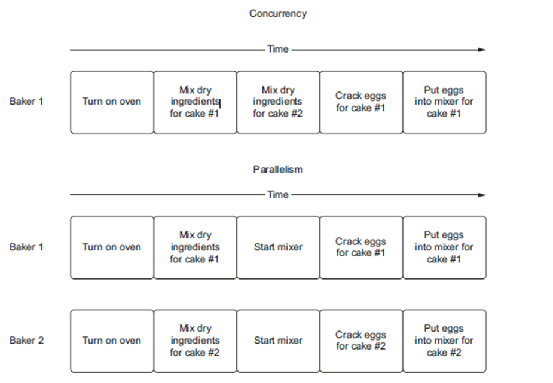
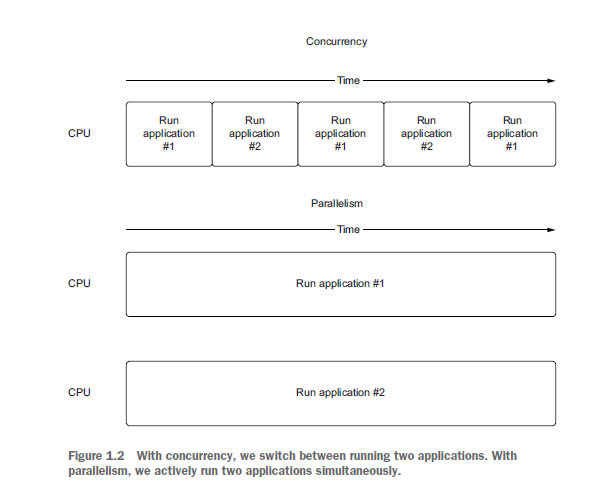

---

### الفرق بين التزامن (Concurrency) والتوازي (Parallelism)

- **التزامن (Concurrency)** يتعلق بوجود مهام متعددة يمكن أن تحدث بشكل مستقل عن بعضها البعض. يمكن تحقيق **التزامن** حتى على وحدة معالجة مركزية (CPU) تحتوي على نواة واحدة، حيث ستستخدم العملية تعدد المهام القسري (preemptive multitasking) للتبديل بين المهام.

- **التوازي (Parallelism)**، يعني أنه يجب علينا تنفيذ مهمتين أو أكثر في نفس الوقت. على جهاز يحتوي على نواة واحدة، هذا ليس ممكنًا. لجعل ذلك ممكنًا، نحتاج إلى وحدة معالجة مركزية تحتوي على نوى متعددة يمكنها تشغيل مهمتين معًا.

🔍 **نقطة مهمة**: بينما يشير التوازي إلى إمكانية تنفيذ عدة مهام في نفس الوقت، فإن التزامن لا يعني وجود توازي.

عندما نتحدث عن تطبيق يستخدم **المهام المتعددة (multithreading)** على جهاز يحتوي على نوى متعددة، فهذا يعني أن التطبيق يمكنه القيام بأكثر من مهمة في نفس الوقت. في هذا النوع من الإعدادات، يمكن تنفيذ مهام متعددة بشكل **تزامني**، حيث تعمل كل مهمة بشكل مستقل على نواة مختلفة.

---
## ما هو تعدد المهام؟ (What is multitasking?)

تعدد المهام موجود في كل مكان في عالم اليوم. نحن نقوم بتعدد المهام أثناء إعداد الإفطار من خلال تلقي مكالمة أو الرد على رسالة نصية بينما ننتظر غليان الماء لتحضير الشاي. نحن حتى نقوم بتعدد المهام أثناء التنقل إلى العمل، من خلال قراءة كتاب بينما تأخذنا القطار إلى المحطة.

#### نوعان رئيسيان من تعدد المهام:

1. **تعدد المهام القسري (Preemptive Multitasking)**:
   - في هذا النموذج، نترك نظام التشغيل يقرر كيفية التبديل بين المهام التي يتم تنفيذها حاليًا من خلال عملية تُسمى **تقسيم الوقت (Time Slicing)**.
   - عندما يقوم نظام التشغيل بالتبديل بين الأعمال، نطلق عليه اسم **الإيقاف القسري (Preempting)**. 
   - يتم إدارة تشغيل المهام بواسطة نظام التشغيل، حيث يقوم بتحديد متى وكيف ينتقل بين المهام المختلفة.

   #### كيف يعمل؟
   - **تقسيم الوقت (Time Slicing)**:
     - يقوم نظام التشغيل بتقسيم الوقت المتاح لكل مهمة إلى فترات زمنية قصيرة تُعرف باسم "شريحة الوقت".
     - يتم تخصيص كل شريحة زمنية لمهمة معينة، مما يسمح لنظام التشغيل بتنفيذ العديد من المهام بشكل متسلسل.
  
   - **الإيقاف القسري (Preempting)**:
     - عندما تنتهي شريحة الوقت لمهمة معينة، يقوم نظام التشغيل بإيقاف هذه المهمة (أو "الإيقاف القسري") والانتقال إلى مهمة أخرى.
     - هذا يعني أن المهام يمكن أن تتوقف في أي وقت إذا استهلكت وقتها المحدد، حتى لو كانت لا تزال تعمل.

2. **تعدد المهام التعاوني (Cooperative Multitasking)**:
   - هذا النموذج هو أسلوب لإدارة المهام حيث يتم التحكم بتبديل المهام بشكل صريح بواسطة التطبيق نفسه، وليس بواسطة نظام التشغيل.
   - في هذا النموذج، تقوم كل مهمة في التطبيق بتحديد نقاط معينة في الكود حيث يمكنها التوقف مؤقتًا والسماح لمهام أخرى بالعمل.

   🔄 **كيفية عمله**:
   - تقوم المهام في هذا النظام بالتعاون مع بعضها البعض، حيث تقول كل مهمة بشكل صريح: "سأتوقف عن العمل مؤقتًا؛ يمكنكم الآن تشغيل المهام الأخرى."
   - هذا الأسلوب يتطلب من المبرمجين كتابة الكود بحيث تكون هناك نقاط يمكن عندها التبديل بين المهام، مما يضمن أن جميع المهام تحصل على فرصتها للعمل دون تدخل مباشر من نظام التشغيل.
   - على سبيل المثال، إذا كانت مهمة معينة تحتاج إلى انتظار مدخلات من المستخدم، يمكنها التوقف عند تلك النقطة والسماح لمهام أخرى بالعمل حتى تتلقى المدخلات المطلوبة وتستأنف عملها.

إليك النص مع إضافة بعض الرموز التعبيرية لتحسين العرض:

---

### فوائد تعدد المهام التعاوني (Cooperative Multitasking) 🌐

تستخدم مكتبة `asyncio` في Python **تعدد المهام التعاوني** لتحقيق **التزامن**. عندما تصل تطبيقاتنا إلى نقطة قد تضطر فيها للانتظار لبعض الوقت للحصول على نتيجة، نقوم بتمييز هذه النقطة في الكود بشكل صريح. هذا يسمح لجزء آخر من الكود بالعمل أثناء انتظارنا للحصول على النتيجة في الخلفية. ⏳

💡 **فائدة هذا الأسلوب**: بمجرد الانتهاء من المهمة التي قمنا بتمييزها، يمكننا "الاستيقاظ" واستئناف تنفيذ المهمة. هذا يمنحنا شكلًا من أشكال **التزامن**، حيث يمكن أن تبدأ المهام في نفس الوقت، ولكن بشكل مهم، ليس **التوازي (Parallelism)**، لأنهم لا ينفذون الكود في نفس الوقت.

#### فوائد تعدد المهام التعاوني مقارنة بتعدد المهام القسري (Preemptive Multitasking) ⚖️:

1. **استهلاك الموارد**:
   - تعدد المهام التعاوني أقل استهلاكًا للموارد. عندما يحتاج نظام التشغيل إلى التبديل بين thread أو عملية قيد التشغيل، يتطلب ذلك عملية تُسمى **التبديل السياقي (Context Switch)**. 🔄
   - تعتبر عمليات التبديل السياقي مكثفة لأن نظام التشغيل يجب أن يحتفظ بمعلومات حول العملية أو thread الذي يتم تشغيله ليكون قادرًا على إعادة تحميله.

2. **الدقة**:
   - يعرف نظام التشغيل أن thread أو المهمة يجب أن تتوقف بناءً على أي خوارزمية جدولة يستخدمها، ولكن قد لا يكون ذلك هو أفضل وقت للتوقف. 🕒
   - مع **تعدد المهام التعاوني**، نقوم بتمييز المناطق التي تكون الأفضل لتوقف مهامنا. هذا يمنحنا بعض مكاسب الكفاءة لأننا نتبدل المهام فقط عندما نعرف صراحة أنه الوقت المناسب للقيام بذلك. 🎯

---

### فهم العمليات، الـ Threads، تعدد المهام المتعدد (Multithreading)، وتعدد العمليات (Multiprocessing) 🔍

لفهم كيفية عمل **التزامن** في عالم Python، نحتاج أولاً إلى فهم الأساسيات حول كيفية عمل **العمليات (Processes)** و**الـ Threads**. ثم سنستعرض كيفية استخدام **تعدد المهام المتعدد (Multithreading)** و**تعدد العمليات (Multiprocessing)** لأداء الأعمال بشكل متزامن.

إذا كان هناك أي شيء آخر تود إضافته أو تغييره، فأخبرني!

#### تعريفات أساسية:

- **العملية (Process)**:
  - العملية هي تطبيق يتم تشغيله وله مساحة ذاكرة لا يمكن للتطبيقات الأخرى الوصول إليها. 🖥️
  - مثال على إنشاء عملية Python سيكون تشغيل تطبيق بسيط مثل "hello world" أو كتابة `python` في سطر الأوامر لبدء بيئة العمل التفاعلية (REPL).
  
  🔄 **ملاحظة**: يمكن تشغيل عمليات متعددة على جهاز واحد. إذا كنا على جهاز يحتوي على وحدة معالجة مركزية (CPU) بها أنوية متعددة، يمكننا تنفيذ عمليات متعددة في نفس الوقت. 
  - إذا كنا على وحدة معالجة مركزية تحتوي على نواة واحدة فقط، يمكننا أيضًا تشغيل تطبيقات متعددة في وقت واحد من خلال تقنيات **تقسيم الوقت (Time Slicing)**.
  
  - عندما يستخدم نظام التشغيل تقسيم الوقت، فإنه سيتحول بين العمليات التي تعمل تلقائيًا بعد فترة زمنية معينة. تختلف الخوارزميات التي تحدد متى يحدث هذا التبديل حسب نظام التشغيل.
#### (Threads)  
يمكن اعتبار **Threads** كعمليات أخف وزنًا. بالإضافة إلى ذلك، فإنها تعتبر أصغر وحدة يمكن إدارتها بواسطة نظام التشغيل. لا تمتلك **Threads** ذاكرة خاصة بها كما تفعل العمليات؛ بدلاً من ذلك، تشارك ذاكرة العملية التي أنشأتها. ترتبط **Threads** بالعملية التي أنشأتها. ستحتوي العملية دائمًا على **Thread** واحد على الأقل مرتبط بها، وعادة ما يُعرف بـ **main thread**.

يمكن للعملية أيضًا إنشاء **Threads** أخرى، والتي تُعرف بشكل أكثر شيوعًا multithreading العاملة أو الخلفية (**worker** or **background threads**). يمكن أن تؤدي هذه **Threads** أعمالًا أخرى **concurrently** مع **main thread**. تشبه **Threads** العمليات، حيث يمكن تشغيلها جنبًا إلى جنب على وحدة معالجة مركزية متعددة النوى، ويمكن أيضًا أن يتبدل نظام التشغيل بينها عبر تقسيم الوقت.

عند تشغيل تطبيق Python عادي، نقوم بإنشاء عملية بالإضافة إلى **main thread**، الذي سيكون مسؤولًا عن تشغيل تطبيق Python الخاص بنا.

### العمليات و الـ Threads في تطبيق Python بسيط

لفهم **العمليات**، **Threads**، **Multithreading**، و **Multiprocessing**:

```python
import threading

total_threads = threading.active_count()
thread_name = threading.current_thread().name
print(f'Python is currently running {total_threads} thread(s)')
print(f'The current thread is {thread_name}')
```

هذا المثال البسيط يعرض كيفية استخدام **المكتبة threading** في Python لعرض عدد الـ **threads** النشطة حاليًا واسم الـ **thread** الحالي.

نقوم بإنشاء تطبيق بسيط ليوضح لنا أساسيات **main Thread**. أولاً، نحصل على معرف العملية (**process ID**)، وهو معرف فريد للعملية، ونطبعه لإثبات أن لدينا بالفعل عملية مخصصة قيد التشغيل. بعد ذلك، نحصل على عدد الـ **threads** النشطة التي تعمل بالإضافة إلى اسم الـ **thread** الحالي لإظهار أننا نشغل **thread** واحدًا—وهو **main thread**. بينما سيكون معرف العملية مختلفًا في كل مرة يتم فيها تشغيل هذا الكود، فإن تشغيل القائمة 1.2 سيعطي إخراجًا مشابهًا لما يلي:

```python
import threading
import os

process_id = os.getpid()  # Get the current process ID
total_threads = threading.active_count()  # Get the number of active threads
thread_name = threading.current_thread().name  # Get the name of the current thread

print(f'Process ID: {process_id}')
print(f'Python is currently running {total_threads} thread(s)')
print(f'The current thread is {thread_name}')
```

**الإخراج المتوقع**:

```
Process ID: 12345
Python is currently running 1 thread(s)
The current thread is MainThread
```

الـ **Process ID** سيختلف في كل مرة يتم فيها تشغيل البرنامج، لكن عدد الـ **threads** سيكون 1 إذا لم نقم بإنشاء أي threads إضافية.

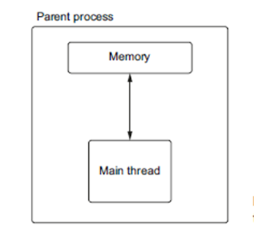
إليك النسخة المعدلة باستخدام المصطلحات الإنجليزية:

---

**الـ Process مع Main Thread واحد يقرأ من الذاكرة**  
في **الشكل السابق-**، نرسم الـ Process الخاصة بالقائمة 1.2. نقوم بإنشاء تطبيق بسيط يوضح لنا أساسيات الـ Main Thread. أولاً، نحصل على معرف الـ Process (وهو معرف فريد للـ Process) ونقوم بطباعته لإثبات أن لدينا بالفعل Process مخصصة قيد التشغيل. بعد ذلك، نحصل على عدد **الـ Threads النشطة** التي تعمل حاليًا بالإضافة إلى اسم الـ Thread الحالي لإظهار أننا نشغل Thread واحدًا — وهو الـ Main Thread.  
بينما سيكون معرف الـ Process مختلفًا في كل مرة يتم فيها تشغيل هذا الكود، فإن تشغيل القائمة 1.2 سيعطي إخراجًا مشابهًا لما يلي:  
```
Python process running with process id: 98230
Python currently running 1 thread(s)
The current thread is MainThread
```
يمكن أيضًا للـ Process إنشاء Threads أخرى تشارك الذاكرة الخاصة بالـ Process الرئيسية. يمكن لهذه الـ Threads القيام بأعمال أخرى بشكل متزامن لنا من خلال ما يُعرف بـ **multithreading**.

---

**القائمة 1.3**: إنشاء تطبيق Python متعدد الـ Threads
```python
import threading

def hello_from_thread():
    print(f'Hello from thread {threading.current_thread()}!')

hello_thread = threading.Thread(target=hello_from_thread)
hello_thread.start()

total_threads = threading.active_count()
thread_name = threading.current_thread().name
print(f'Python is currently running {total_threads} thread(s)')
print(f'The current thread is {thread_name}')

hello_thread.join()
```

---

**فى الشكل**
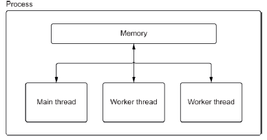
، نرسم الـ Process والـ Threads الخاصة بالكود . نقوم بإنشاء دالة لطباعة اسم الـ Thread الحالي، ثم نقوم بإنشاء Thread لتشغيل تلك الدالة. بعد ذلك، نستدعي دالة **start** الخاصة بالـ Thread لبدء تشغيله. أخيرًا، نستدعي دالة **join**، والتي ستؤدي إلى إيقاف البرنامج حتى ينتهي الـ Thread الذي بدأناه.  
إذا قمنا بتشغيل الكود السابق، سنرى إخراجًا مشابهًا لما يلي:
```
Hello from thread <Thread(Thread-1, started 123145541312512)>!
Python is currently running 2 thread(s)
The current thread is MainThread
```
لاحظ أنه عند تشغيل هذا الكود، قد ترى رسالتي "hello from thread" و"Python is currently running 2 thread(s)" تطبعان في نفس السطر. هذه مشكلة تُعرف بـ **race condition**؛ سنستكشف قليلاً عن ذلك في القسم التالي وفي الفصول 6 و 7.

تُعد التطبيقات متعددة الـ Threads وسيلة شائعة لتحقيق التزامن في العديد من لغات البرمجة. ومع ذلك، هناك بعض التحديات في استخدام التزامن مع الـ Threads في Python. يعتبر **تعدد الـ Threads** مفيدًا فقط للأعمال المعتمدة على المدخلات والمخرجات (**I/O-bound work**) لأننا مقيدون بـ **القفل العالمي للمترجم (Global Interpreter Lock)**، الذي سيتم مناقشته في القسم التالي.

---

**تعدد الـ Threads** ليس الطريقة الوحيدة التي يمكننا من خلالها تحقيق التزامن؛ يمكننا أيضًا إنشاء عمليات متعددة للقيام بالأعمال بالتوازي. تُعرف هذه الطريقة بـ **تعدد العمليات (multiprocessing)**. في **تعدد العمليات**، تقوم الـ Parent Process بإنشاء واحدة أو أكثر من الـ Child Processes التي تديرها. بعد ذلك، يمكنها توزيع العمل على الـ Child Processes.

توفر لنا Python وحدة **multiprocessing** للتعامل مع هذا. تُعد واجهة البرمجة الخاصة بها مشابهة جدًا لتلك الموجودة في وحدة **threading**. نقوم أولاً بإنشاء Process جديدة باستخدام دالة مستهدفة (**target function**). بعد ذلك، نقوم باستدعاء دالة **start** الخاصة بالـ Process لتشغيلها، وأخيرًا نستدعي دالة **join** للانتظار حتى تنتهي الـ Process.

---

**يظهر فى الكود** 
إنشاء عمليات متعددة


```python
import multiprocessing
import os

def hello_from_process():
    print(f'Hello from child process {os.getpid()}!')

if __name__ == '__main__':
    hello_process = multiprocessing.Process(target=hello_from_process)
    hello_process.start()

    print(f'Hello from parent process {os.getpid()}')
    hello_process.join()
```


في الشكل السابق، نعرض عملية thread الخاصة بها كما هو موضح في الكود السابق. نقوم بإنشاء طريقة لطباعة اسم `thread` الحالي، ثم ننشئ `thread` لتشغيل تلك الدالة. بعد ذلك، نستدعي طريقة `start` للخيط لبدء تشغيله. أخيرًا، نستدعي دالة `join`. ستتسبب `join` في إيقاف البرنامج حتى يكتمل تشغيل الخيط الذي بدأناه.

إذا قمنا بتشغيل الكود السابق، سنرى مخرجات مشابهة لما يلي:
```
Hello from thread <Thread(Thread-1, started 123145541312512)>!
Python is currently running 2 thread(s)
The current thread is MainThread
```

لاحظ أنه عند تشغيل هذا، قد ترى رسائل "hello from thread" و "python is currently running 2 thread(s)" تظهر على نفس السطر. هذه حالة سباق (race condition)؛ وسنستكشف القليل عن ذلك في القسم التالي وفي الفصول 6 و 7.

تُعتبر التطبيقات المتعددة  وسيلة شائعة لتحقيق التزامن في العديد من لغات البرمجة. ومع ذلك، هناك بعض التحديات في استخدام التزامن مع threads في بايثون. تعتبر البرمجة المتعددة threads مفيدة فقط للعمل الذي يعتمد على الإدخال/الإخراج (I/O-bound) لأننا مقيدون بقفل المفسر العالمي (GIL)، الذي سيتم مناقشته في القسم 1.5.

لا تعد البرمجة المتعددة threads الطريقة الوحيدة لتحقيق التزامن؛ يمكننا أيضًا إنشاء عمليات متعددة للقيام بالعمل بالتوازي. يُعرف ذلك باسم "البرمجة المتعددة العمليات" (multiprocessing). في البرمجة المتعددة العمليات، تقوم العملية الأم بإنشاء واحدة أو أكثر من العمليات الفرعية التي تديرها. ثم يمكنها توزيع العمل على العمليات الفرعية.

تقدم بايثون لنا وحدة `multiprocessing` للتعامل مع هذا. واجهة برمجة التطبيقات (API) مشابهة لوحدة `threading`. نقوم أولاً بإنشاء عملية مع دالة الهدف (target function). ثم نستدعي طريقة `start` لتنفيذها وأخيرًا طريقة `join` لانتظار اكتمال تشغيلها.
في الكود التالي، نعرض عملية threads الخاصة بها كما هو موضح في الكود السابق . نقوم بإنشاء عملية فرعية واحدة تطبع معرّف العملية (process ID) الخاص بها، ونقوم أيضًا بطباعة معرّف العملية الأم لإثبات أننا نقوم بتشغيل عمليات مختلفة.

عادةً ما تكون البرمجة المتعددة العمليات أفضل عندما يكون لدينا عمل مكثف على وحدة المعالجة المركزية (CPU-intensive work).

قد تبدو البرمجة المتعددة threads والبرمجة المتعددة العمليات وكأنها حلول سحرية لتمكين التزامن في بايثون. ومع ذلك، فإن قوة هذه النماذج في التزامن تعيقها تفاصيل التنفيذ في بايثون - GIL.

###  إنشاء عمليات متعددة
```python
import multiprocessing
import os

def hello_from_process():
    print(f'Hello from child process {os.getpid()}!')

if __name__ == '__main__':
    hello_process = multiprocessing.Process(target=hello_from_process)
    hello_process.start()
    print(f'Hello from parent process {os.getpid()}')
    hello_process.join()
```


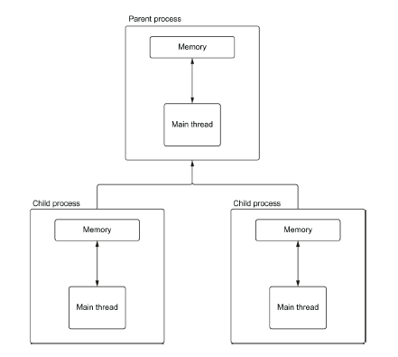
إليك النص المترجم والمُنَسَّق ليكون مناسبًا للاستخدام في تنسيق Markdown:

---

## فهم القفل العام للمترجم (Global Interpreter Lock - GIL) 🔒

القفل العام للمترجم، المختصر بـ **GIL**، هو موضوع مثير للجدل في مجتمع بايثون. بإيجاز، يمنع الـ GIL عملية بايثون واحدة من تنفيذ أكثر من تعليمات بايت بايثون في وقت واحد. وهذا يعني أنه حتى لو كان لدينا عدة **threads** على جهاز مزود بأنوية متعددة، يمكن لعملية بايثون واحدة أن تعمل بها thread واحدة فقط في وقت معين. في عالم يحتوي على وحدات معالجة مركزية متعددة النوى، يمكن أن يشكل ذلك تحديًا كبيرًا لمطوري بايثون الذين يسعون للاستفادة من **multithreading** لتحسين أداء تطبيقاتهم.

> **ملاحظة**: يمكن لـ **multiprocessing** تشغيل تعليمات بايت متعددة في وقت واحد، لأن كل عملية بايثون لديها قفل GIL خاص بها.

### لماذا يوجد الـ GIL؟

الجواب يكمن في كيفية إدارة الذاكرة في **CPython**. في **CPython**، تتم إدارة الذاكرة بشكل أساسي بواسطة عملية تُعرف بـ **العد المرجعي** (Reference Counting). يعمل العد المرجعي عن طريق تتبع من يحتاج حاليًا للوصول إلى كائن بايثون معين، مثل عدد صحيح، أو قاموس، أو قائمة. 

- **العد المرجعي** هو عدد صحيح يتتبع عدد الأماكن التي تشير إلى ذلك الكائن المحدد. 
- عندما لا يحتاج شخص ما إلى ذلك الكائن، يتم تقليل العد المرجعي، وعندما يحتاج شخص آخر إليه، يتم زيادته. 
- عندما يصل العد المرجعي إلى الصفر، لا أحد يشير إلى الكائن، ويمكن حذفه من الذاكرة.

### ما هو CPython؟

**CPython** هو التطبيق المرجعي للغة بايثون. بمعنى التطبيق المرجعي، يعني أنه التنفيذ القياسي للغة ويستخدم كمرجع للسلوك الصحيح للغة. هناك تطبيقات أخرى للغة بايثون مثل **Jython**، المصممة للعمل على **Java Virtual Machine**، و**IronPython**، المصممة لإطار العمل **.NET**.

### النزاع مع threads

تنبع المشكلة مع **threads** من أن التنفيذ في **CPython** ليس آمنًا ضد **threads**. عندما نقول إن **CPython** ليس آمنًا ضد **threads**، نعني أنه إذا قامت اثنتان أو أكثر من **threads** بتعديل متغير مشترك، فقد ينتهي هذا المتغير في حالة غير متوقعة. هذه الحالة غير المتوقعة تعتمد على ترتيب وصول **threads** إلى المتغير، المعروف عمومًا بـ **حالة السباق (Race Condition)**.

يمكن أن تنشأ حالات السباق عندما تحتاج اثنتان من **threads** إلى الإشارة إلى كائن بايثون في نفس الوقت. كما هو موضح في الشكل التالي إذا زادت اثنتان من **threads** العد المرجعي في وقت واحد، قد نواجه حالة حيث تتسبب **thread** واحدة في أن يكون العد المرجعي صفرًا بينما لا تزال **thread** الأخرى تستخدم الكائن. النتيجة المحتملة لهذا ستكون انهيار التطبيق عندما نحاول قراءة الذاكرة المحذوفة المحتملة.

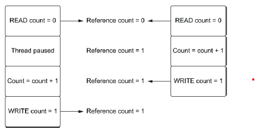

---

## الشكل السابث حالة race condition حيث تحاول اثنتان من الـ threads زيادة العد المرجعي في نفس الوقت. بدلاً من الحصول على عد متوقع يساوي اثنين، نحصل على واحد.

لتوضيح تأثير الـ GIL على برمجة **multithreaded**، دعونا نبحث في مهمة تتطلب موارد معالجة مركزية عالية وهي حساب العدد **nth** في تسلسل **Fibonacci**. سنستخدم تنفيذًا بطيئًا نسبيًا للخوارزمية لتوضيح عملية تستغرق وقتًا طويلاً. الحل المناسب سيستخدم تقنية **memoization** أو تقنيات رياضية لتحسين الأداء.

### قائمة 1.5: توليد وتوقيت تسلسل Fibonacci

```python
import time

def print_fib(number: int) -> None:
    def fib(n: int) -> int:
        if n == 1:
            return 0
        elif n == 2:
            return 1
        else:
            return fib(n - 1) + fib(n - 2)
    
    print(f'fib({number}) is {fib(number)}')

def fibs_no_threading():
    print_fib(40)
    print_fib(41)
    
    start = time.time()
    fibs_no_threading()
    end = time.time()
    print(f'Completed in {end - start:.4f} seconds.')
```

يستخدم هذا التنفيذ **التكرار (recursion)** وهو خوارزمية بطيئة نسبيًا، تتطلب وقتًا أُسّيًا **O(2^N)** لإكمالها. إذا كنا في موقف نحتاج فيه إلى طباعة عددين من **Fibonacci**، فمن السهل استدعاؤهما بشكل متزامن وقياس النتيجة، كما فعلنا في القائمة السابقة.

اعتمادًا على سرعة وحدة المعالجة المركزية التي نشغل عليها، سنرى توقيتات مختلفة، لكن تشغيل الكود في قائمة 1.5 سيعطي مخرجات مشابهة لما يلي:

```
fib(40) is 63245986
fib(41) is 102334155
Completed in 65.1516 seconds.
```

هذه عملية حساب طويلة إلى حد ما، لكن استدعاءاتنا إلى **print_fibs** مستقلة عن بعضها البعض. وهذا يعني أنه يمكن وضعها في عدة **threads** يمكن لوحدتنا المعالجة، نظريًا، تشغيلها بشكل متزامن على نوى متعددة، وبالتالي تسريع تطبيقنا.

### قائمة 1.6: تنفيذ تسلسل Fibonacci باستخدام **multithreading**

```python
import threading
import time

def print_fib(number: int) -> None:
    def fib(n: int) -> int:
        if n == 1:
            return 0
        elif n == 2:
            return 1
        else:
            return fib(n - 1) + fib(n - 2)

def fibs_with_threads():
    fortieth_thread = threading.Thread(target=print_fib, args=(40,))
    forty_first_thread = threading.Thread(target=print_fib, args=(41,))
    
    fortieth_thread.start()
    forty_first_thread.start()
    
    fortieth_thread.join()
    forty_first_thread.join()
    
    start_threads = time.time()
    fibs_with_threads()
    end_threads = time.time()
    print(f'Threads took {end_threads - start_threads:.4f} seconds.')
```

في القائمة السابقة، نقوم بإنشاء اثنتين من **threads**، واحدة لحساب **fib(40)** والأخرى لحساب **fib(41)**، ونبدأهما بشكل متزامن عن طريق استدعاء `start()` لكل **thread**. ثم نقوم باستدعاء `join()`، مما سيجعل برنامجنا الرئيسي ينتظر حتى تنتهي **threads**. بالنظر إلى أننا بدأنا حساب **fib(40)** و**fib(41)** في نفس الوقت وقمنا بتشغيلهما بشكل متزامن، قد تعتقد أننا يمكن أن نرى تسريعًا معقولًا؛ ومع ذلك، سنرى مخرجات مشابهة لما يلي حتى على جهاز مزود بأنوية متعددة:

```
fib(40) is 63245986
fib(41) is 102334155
Threads took 66.1059 seconds.
```

استغرقت النسخة باستخدام **threads** تقريبًا نفس كمية الوقت. في الواقع، كانت أبطأ قليلاً! هذا يرجع تقريبًا بالكامل إلى الـ GIL وتكاليف إنشاء وإدارة **threads**. بينما من الصحيح أن **threads** تعمل بشكل متزامن، إلا أنه يُسمح لواحدة فقط منها بتشغيل كود بايثون في وقت معين بسبب القفل. هذا يترك **thread** الأخرى في حالة انتظار حتى تكتمل الأولى، مما negates تمامًا قيمة **threads** المتعددة.
###  هل يتم تحرير **GIL**؟

🔍 بناءً على المثال السابق، قد تتساءل عما إذا كان يمكن تحقيق **التزامن** في **Python** باستخدام **threads**، نظرًا لأن **GIL** يمنع تشغيل سطرين من كود **Python** في نفس الوقت. ومع ذلك، فإن **GIL** لا يتم الاحتفاظ به إلى الأبد، مما يتيح لنا استخدام **threads** لصالحنا.

🔓 يتم تحرير **GIL** عندما تحدث عمليات **I/O**. هذا يسمح لنا باستخدام **threads** لتنفيذ الأعمال المتزامنة فيما يتعلق بعمليات **I/O**، ولكن ليس عند التعامل مع كود **Python** المرهق للمعالج **(CPU-bound)** (هناك بعض الاستثناءات الملحوظة التي تحرر **GIL** عند القيام بعمليات معالجة ثقيلة في ظروف معينة، وسنتناولها في فصل لاحق). 

#### 📄 لشرح ذلك، دعنا نستخدم مثالًا بسيطًا لقراءة **status code** لصفحة ويب.

```python
import time
import requests

def read_example() -> None:
    response = requests.get('https://www.example.com')
    print(response.status_code)

sync_start = time.time()
read_example()
read_example()
sync_end = time.time()

print(f'Running synchronously took {sync_end - sync_start:.4f} seconds.')
```

🔧 في الكود أعلاه، نقوم بجلب محتويات **example.com** وطباعة **status code** مرتين. بناءً على سرعة الاتصال بالإنترنت وموقعك، قد تحصل على نتائج مشابهة لما يلي:

```
200
200
Running synchronously took 0.2306 seconds.
```

الآن بعد أن حصلنا على أساس لما يبدو عليه الإصدار المتزامن **(synchronous)**، يمكننا كتابة نسخة متعددة **الـ threads** للمقارنة.

#### 📄 نسخة متعددة **الـ threads** لقراءة **status code**:

```python
import time
import threading
import requests

def read_example() -> None:
    response = requests.get('https://www.example.com')
    print(response.status_code)

# Creating two threads
thread_1 = threading.Thread(target=read_example)
thread_2 = threading.Thread(target=read_example)

# Timing the thread execution
thread_start = time.time()
thread_1.start()
thread_2.start()
print('All threads running!')

# Waiting for the threads to complete
thread_1.join()
thread_2.join()

thread_end = time.time()
print(f'Running with threads took {thread_end - thread_start:.4f} seconds.')
```

🎯 عندما ننفذ هذا الكود، سنرى نتائج مشابهة لما يلي، بناءً على سرعة الاتصال بالإنترنت ومواصفات الجهاز:

```
All threads running!
200
200
Running with threads took 0.0977 seconds.
```

📊 هذا أسرع بمرتين تقريبًا من النسخة الأصلية التي لم تستخدم **threads**، حيث تم تشغيل الطلبين في نفس الوقت تقريبًا.

---

### 🧩 كيف يتم تحرير **GIL** لعمليات **I/O** ولكن ليس لعمليات **CPU-bound**؟

🔑 يتم تحرير **GIL** في حالة **I/O** لأن الاستدعاءات النظامية **(system calls)** التي تتم في الخلفية تكون خارج تشغيل **Python**. يسمح هذا بتحرير **GIL** لأن النظام لا يتعامل مباشرة مع كائنات **Python**. يتم إعادة اكتساب **GIL** فقط عند ترجمة البيانات المستلمة مرة أخرى إلى كائنات **Python**. 

🔗 في هذه الحالة، تعمل عمليات **I/O** على مستوى النظام بشكل متزامن، مما يوفر **التزامن** دون **التوازي**.

---

### `asyncio` و **GIL**

🔄 **asyncio** يستغل حقيقة أن عمليات **I/O** تُحرر **GIL**، مما يمنحنا **التزامن** حتى مع وجود **thread** واحد فقط. عند استخدامنا لـ **asyncio**، نقوم بإنشاء كائنات تُدعى **coroutines**. يمكن التفكير في **coroutine** على أنها تعمل مثل **thread** خفيف الوزن. 


💡 تمامًا كما يمكن أن يكون لدينا عدة **threads** تعمل في نفس الوقت، كل منها يتعامل مع عملية **I/O** متزامنة، يمكن أن يكون لدينا العديد من **coroutines** تعمل بجانب بعضها البعض. بينما ننتظر انتهاء **coroutines** المتعلقة بـ **I/O**، يمكننا الاستمرار في تنفيذ كود **Python** آخر، مما يمنحنا **التزامن**.

🔍 من المهم ملاحظة أن **asyncio** لا تتجاوز **GIL**، ولا زلنا خاضعين لها. إذا كان لدينا مهمة تتطلب معالجة مكثفة للمعالج **(CPU-bound)**، فإننا نحتاج لاستخدام عمليات متعددة لتنفيذها بالتزامن (يمكن القيام بذلك مع **asyncio** نفسها)؛ وإلا، سنسبب مشاكل في الأداء في تطبيقنا.

### 🤔 كيف يعمل ذلك مع **sockets** غير المحظورة؟

لنبدأ في استكشاف تفاصيل كيفية عمل **asyncio** مع **sockets** غير المحظورة، حيث توفر لنا القدرة على إدارة عدة اتصالات في نفس الوقت، مما يساهم في تحسين أداء التطبيقات التي تعتمد على **I/O**. 

#### 🚀 مثال على استخدام `asyncio` مع **sockets** غير المحظورة:

```python
import asyncio
import socket

async def fetch_data(host, port):
    reader, writer = await asyncio.open_connection(host, port)
    # Format the host as a string in the bytes literal
    writer.write(f'GET / HTTP/1.0\r\nHost: {host}\r\n\r\n'.encode())
    await writer.drain()  # Ensure data is sent

    data = await reader.read(100)
    print(f'Received: {data.decode()}')
    
    writer.close()
    await writer.wait_closed()

async def main():
    hosts = [('www.example.com', 80), ('www.google.com', 80)]
    tasks = [fetch_data(host, port) for host, port in hosts]
    await asyncio.gather(*tasks)

asyncio.run(main())

```

### 🔍 شرح الكود:

بالطبع! لنغوص في تفاصيل الكود خطوة بخطوة. سأشرح كل جزء من العملية التي تتضمن فتح اتصال غير محظور، وكتابة البيانات، وقراءة البيانات، وإغلاق الاتصال.

### 1. فتح الاتصال

عند استخدام دالة `asyncio.open_connection`، نقوم بفتح اتصال غير محظور مع الخادم. هذا يعني أننا لن نقوم بوقف تنفيذ البرنامج أثناء انتظار الاتصال.

```python
reader, writer = await asyncio.open_connection(host, port)
```

- **`host`**: هو عنوان الخادم الذي نريد الاتصال به (مثل `www.example.com`).
- **`port`**: هو رقم المنفذ الذي يستمع إليه الخادم (عادةً 80 لـ HTTP و443 لـ HTTPS).
- **`reader` و`writer`**: هذان الكائنان يستخدمان لقراءة البيانات من الاتصال وكتابة البيانات إليه، على التوالي.

### 2. كتابة البيانات

بعد فتح الاتصال، نحتاج إلى إرسال طلب إلى الخادم. هذا يتم عادةً باستخدام بروتوكول HTTP.

```python
writer.write(request.encode())
```

- **`request`**: هو النص الذي يمثل طلب HTTP. يجب أن يتم ترميزه إلى بايتات باستخدام `encode()` قبل إرساله.
- **`writer.write `** تستخدم هذه الدالة لكتابة البيانات إلى الاتصال. من المهم ملاحظة أننا قد نحتاج إلى استخدام 
- `await writer.drain` بعد كتابة البيانات للتأكد من أن البيانات قد أُرسلت بالفعل.

### 3. قراءة البيانات

بعد إرسال الطلب، نحتاج إلى الانتظار واستلام البيانات من الخادم. يمكن القيام بذلك باستخدام دالة `reader.read`.

```python
response = await reader.read()
```

- **`reader.read()`**: هذه الدالة تنتظر حتى يتم استلام البيانات. وعندما تتلقى البيانات، يتم تخزينها في المتغير `response`.
- قد نحتاج إلى تحديد عدد البايتات التي نريد قراءتها، أو يمكن استخدام دوال مثل `reader.readline()` لقراءة البيانات حتى الوصول إلى نهاية السطر.

### 4. إغلاق الاتصال

بعد الانتهاء من قراءة البيانات، من المهم إغلاق الاتصال لتحرير الموارد.

```python
writer.close()
await writer.wait_closed()
```

- **`writer.close`**: تغلق هذا الاتصال، مما يعني أننا لن نستطيع إرسال المزيد من البيانات.
- **`await writer.wait_closed`**: هذه الدالة تضمن أن الاتصال قد تم إغلاقه بالكامل قبل أن ننتقل إلى أي عمليات أخرى. هذا مفيد لضمان عدم وجود تسرب للموارد.

### مثال كامل

إليك مثال كامل لكيفية تنفيذ ذلك:

```python
import asyncio

async def fetch_data(host, port):
    reader, writer = await asyncio.open_connection(host, port)

    # كتابة طلب HTTP
    request = 'GET / HTTP/1.1\r\nHost: {}\r\n\r\n'.format(host)
    writer.write(request.encode())
    await writer.drain()

    # قراءة الاستجابة
    response = await reader.read()

    # طباعة الاستجابة
    print(response.decode())

    # إغلاق الاتصال
    writer.close()
    await writer.wait_closed()

# تشغيل الدالة
asyncio.run(fetch_data('www.example.com', 80))
```

### الخلاصة

تتيح لنا مكتبة `asyncio` التعامل مع اتصالات الشبكة بشكل غير محظور، مما يعزز أداء التطبيقات التي تعتمد على إدخال وإخراج البيانات، مثل تطبيقات الويب أو البرامج التي تتفاعل مع واجهات برمجة التطبيقات.
🕒 باستخدام `asyncio`، يمكننا إجراء اتصالات متعددة بالتزامن، مما يحقق كفاءة أفضل أثناء انتظار استجابة الخادم. هذا يعكس قدرة **asyncio** على استغلال **GIL** لتحسين أداء عمليات **I/O**، مما يجعلها أداة قوية لتطبيقات الشبكة.


---


## كيف تعمل التزامن في الـ Thread الواحد

في القسم السابق، قدمنا الـ Threads المتعددة كآلية لتحقيق التزامن في عمليات الإدخال والإخراج.

ومع ذلك، لا نحتاج إلى Threads متعددة لتحقيق هذا النوع من التزامن. يمكننا القيام بكل ذلك ضمن حدود عملية واحدة وThread واحد.

نقوم بذلك من خلال استغلال حقيقة أن عمليات الإدخال والإخراج يمكن أن تُنفذ بشكل متزامن على مستوى النظام، مما يعني أنه يمكن للنظام التعامل مع أكثر من عملية إدخال وإخراج في الوقت نفسه.

لفهم ذلك بشكل أفضل، سنحتاج إلى الغوص في كيفية عمل الـ Sockets، وبشكل خاص كيفية عمل الـ Sockets غير الحاصرة.

---


## ما هي الـ Sockets؟ 

🔌 **الـ Socket** هي مفهوم أساسي لإرسال واستقبال البيانات عبر الشبكة. وهي الأساس لكيفية نقل البيانات إلى ومن الخوادم. 

📦 **عمليات الـ Socket** تدعم عمليتين رئيسيتين:
- **إرسال البايتات** 
- **استقبال البايتات** 

نكتب البايتات إلى الـ Socket، والتي سيتم إرسالها بعد ذلك إلى عنوان بعيد، عادة ما يكون نوعًا من الخوادم. بمجرد إرسال هذه البايتات، ننتظر من الخادم أن يكتب رده مرة أخرى إلى الـ Socket الخاص بنا. بعد أن يتم إرسال هذه البايتات مرة أخرى إلى الـ Socket، يمكننا قراءة النتيجة.

📬 **فهم الـ Sockets**:  
يمكنك التفكير في الـ Sockets كصناديق بريد. يمكنك وضع رسالة في صندوق بريدك، ثم يلتقطها حامل الرسائل ويسلمها إلى صندوق بريد المستلم. يفتح المستلم صندوق بريده ويقرأ رسالتك. اعتمادًا على المحتوى، قد يرسل لك المستلم رسالة رد. 

✉️ في هذا التشبيه:
- الرسالة تمثل البيانات أو البايتات التي نريد إرسالها.
- وضع الرسالة في صندوق البريد هو كتابة البايتات إلى الـ Socket.
- فتح صندوق البريد لقراءة الرسالة هو قراءة البايتات من الـ Socket.

🚚 **آلية النقل**:  
يمكن اعتبار حامل الرسائل كآلية النقل عبر الإنترنت، التي تقوم بتوجيه البيانات إلى العنوان الصحيح.

🌐 **مثال عملي**:  
في حالة الحصول على المحتويات من example.com كما رأينا سابقًا، نقوم بفتح Socket تتصل بخادم example.com. ثم نكتب طلبًا للحصول على المحتويات إلى تلك الـ Socket وننتظر من الخادم أن يرد بالنتيجة: في هذه الحالة، HTML صفحة الويب. يمكننا تصور تدفق البايتات من وإلى الخادم كما هو موضح في الشكل التالي.

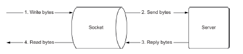

---


## كتابة البايتات إلى الـ Socket وقراءة البايتات من الـ Socket

🔒 **الـ Sockets** تكون **blocking** بشكل افتراضي. ببساطة، هذا يعني أنه عندما ننتظر من خادم أن يرد بالبيانات، نقوم بإيقاف تطبيقنا حتى نحصل على بيانات للقراءة. وبالتالي، يتوقف تطبيقنا عن تشغيل أي مهام أخرى حتى نحصل على بيانات من الخادم، أو يحدث خطأ، أو يحدث انتهاء للوقت.

## 🚀 (non-blocking)

على مستوى نظام التشغيل، لا نحتاج إلى القيام بهذا الـ **blocking**. يمكن أن تعمل الـ Sockets في وضع **non-blocking**.

### كيف يعمل ذلك؟

1. **✍️ كتابة البيانات**:  
   عندما نكتب بايتات إلى الـ Socket، يمكننا ببساطة "إطلاق" عملية الكتابة دون الحاجة للانتظار حتى يتم إرسال البيانات. 

2. **🔄 استمرار التطبيق**:  
   بعد كتابة البيانات، يستمر تطبيقنا في العمل على مهام أخرى بدلاً من التوقف. هذا يعني أنه يمكننا تنفيذ عمليات إضافية أو التعامل مع مدخلات جديدة من المستخدم.

3. **📬 الإخطار بالبيانات**:  
   لاحقًا، عندما يتم استلام بيانات جديدة من الخادم، يُخبرنا نظام التشغيل بذلك. هذا الإشعار يعني أنه يمكننا الآن معالجة البيانات الجديدة دون الحاجة إلى الانتظار.

4. **💡 زيادة التفاعلية**:  
   بهذه الطريقة، نصبح أكثر تفاعلية. بدلاً من الانتظار بشكل سلبي حتى نحصل على البيانات، نكون قادرين على الاستمرار في العمل والقيام بأشياء أخرى حتى يتم استلام البيانات.

### ✅ الفوائد:
- **زيادة الكفاءة**: نستفيد من الوقت بدلاً من الانتظار.
- **تحسين الأداء**: يمكن أن يؤدي ذلك إلى تطبيقات أكثر استجابة، حيث لا تتوقف عن العمل لمجرد انتظار البيانات.

### 📡 **Event Notification Systems (أنظمة إشعار الأحداث)**

**English**:  
Event Notification Systems are used to monitor I/O sources such as files, networks, and ports (like serial ports), in addition to system operations and other applications. These systems allow applications to be aware of any changes happening to these sources or "events" like new data arrival, completion of a write operation, or even an error.

**Arabic**:  
أنظمة إشعار الأحداث تُستخدم لمراقبة مصادر الإدخال/الإخراج مثل الملفات، الشبكات، والمنافذ (مثل المنافذ التسلسلية)، بالإضافة إلى عمليات النظام والتطبيقات الأخرى. تسمح هذه الأنظمة للتطبيقات بأن تكون على علم بأي تغييرات تحدث على هذه المصادر أو "أحداث" مثل وصول بيانات جديدة، أو انتهاء عملية الكتابة، أو حتى ظهور خطأ.

---

### 🔄 **Basic Operation Steps (خطوات العمل الأساسية)**

#### 1. **Registering Interest in Events (تسجيل الاهتمام بالأحداث)**

**English**:  
The application initially registers its interest in monitoring certain events for specific resources. For instance, if the application interacts with a network, it registers interest in monitoring an event like the arrival of new data (such as a new connection or message on the port). This is done through specific system functions, depending on the operating system (like `epoll_ctl` in Linux or `CreateIoCompletionPort` in Windows).

**Arabic**:  
التطبيق في البداية يقوم بتسجيل اهتمامه في متابعة أحداث معينة تخص موارد معينة. على سبيل المثال، إذا كان التطبيق يتعامل مع شبكة، فإنه يسجل اهتمامه بمتابعة حدث وصول بيانات جديدة (مثل اتصال جديد أو رسالة جديدة على المنفذ). هذا يتم عبر دوال خاصة يُقدمها النظام، وتختلف حسب النظام المستخدم (مثل `epoll_ctl` في Linux أو `CreateIoCompletionPort` في Windows).

---

#### 2. **Managing Resources (إدارة الموارد)**

**English**:  
The Event Notification System manages all the resources registered by the application. These resources may include:
- **Files**: Monitoring file operations like reading or writing.
- **Network Sockets**: Monitoring network events like new connections or data arrival.
- **Serial Ports**: Managing data flow via serial ports (e.g., COM port in Windows).
- **Other devices**: Peripheral devices or storage drives.

Each system manages a list of resources, and whenever there’s a change or new operation, the system notifies the application.

**Arabic**:  
الـ **Event Notification System** يقوم بإدارة جميع الموارد التي تم تسجيلها. هذه الموارد قد تكون:
- **ملفات**: مثل فتح ملفات للقراءة أو الكتابة.
- **مقابس الشبكة (Sockets)**: مثل انتظار بيانات من اتصال TCP أو UDP.
- **منافذ تسلسلية (Serial Ports)**: مثل قراءة أو كتابة البيانات عبر منفذ COM في Windows.
- **أجهزة أخرى**: يمكن أن تكون مثل الأجهزة الطرفية أو مخازن البيانات.

كل نظام إشعار يقوم بإدارة قائمة من الموارد، وعند حدوث أي تغيير أو عملية جديدة، يتم إخطار النظام بذلك.

---

#### 3. **Entering Wait State (الدخول في حالة انتظار)**

**English**:  
After registering, the application enters a waiting state, pausing its operations until the event occurs. This waiting can be asynchronous, meaning the application can perform other tasks or "sleep" until it receives the notification.

**Arabic**:  
بعد تسجيل الاهتمام، يدخل التطبيق في حالة انتظار حتى يتم إعلامه بحدوث التغييرات. هذا الانتظار قد يكون "انتظارًا غير متزامن" (Asynchronous Waiting)، مما يعني أن التطبيق يمكنه القيام بمهام أخرى أو النوم حتى يصله الإشعار المناسب.

---

#### 4. **Receiving the Notification (استقبال الإشعار)**

**English**:  
Once the event occurs (e.g., data arrives over the network or a file operation completes), the system sends a notification to the application. The application can then proceed to handle the event as needed.

**Arabic**:  
عندما يحدث الحدث المطلوب (مثل وصول بيانات عبر الشبكة أو إنهاء الكتابة إلى ملف)، يقوم النظام بإخطار التطبيق. هذا الإشعار يُرسل إلى التطبيق عبر نظام الإشعارات الذي تم تهيئته مسبقًا.

---

#### 5. **Handling the Event (معالجة الحدث)**

**English**:  
After receiving the notification, the application processes the data or event. For example:
- Reading data from a serial port.
- Completing a file write operation.

**Arabic**:  
بعد تلقي الإشعار، يقوم التطبيق بمعالجة البيانات أو الحدث. على سبيل المثال:
- قراءة البيانات من المنفذ التسلسلي.
- متابعة أو إنهاء عملية كتابة البيانات إلى ملف.

---

### 🎯 **Types of Resources (العمليات والموارد التي تتعامل معها أنظمة إشعار الأحداث)**

#### 1. **Files (الملفات)**:
   - **When is the notification triggered?**  
     When a file is opened, modified, or when data reading or writing operations complete. Systems like `epoll` efficiently monitor multiple files.

   **Arabic**:  
   - **متى يحدث الإشعار؟** عندما يتم فتح أو تعديل ملف، أو عند الانتهاء من قراءة أو كتابة البيانات. بعض الأنظمة مثل `epoll` يمكنها مراقبة ملفات متعددة بكفاءة عالية.

---

#### 2. **Network Sockets (مقابس الشبكة)**:
   - **When is the notification triggered?**  
     When a new connection is received, data becomes available, or when a port is ready to send data.

   **Arabic**:  
   - **متى يحدث الإشعار؟** عند تلقي اتصال جديد أو استقبال بيانات جديدة، أو عندما يصبح المنفذ جاهزًا لإرسال البيانات.

---

#### 3. **Serial Ports (المنافذ التسلسلية)**:
   - **When is the notification triggered?**  
     When data is received or sent over a serial port like COM in Windows.

   **Arabic**:  
   - **متى يحدث الإشعار؟** عندما يتم استقبال أو إرسال بيانات عبر منفذ تسلسلي مثل COM في Windows.

---

#### 4. **Peripheral Devices (الأجهزة الطرفية)**:
   - **When is the notification triggered?**  
     When a new device is connected (e.g., USB), or an I/O operation is completed.

   **Arabic**:  
   - **متى يحدث الإشعار؟** عند اتصال جهاز جديد بالنظام (مثل جهاز USB) أو انتهاء عملية إدخال/إخراج.

---

### 🌟 **Benefits (فوائد استخدام أنظمة إشعار الأحداث)**

**English**:  
- **Resource efficiency**: Applications are notified only when events happen, avoiding continuous polling.
- **Instant response**: Immediate notification upon event occurrence, enhancing responsiveness.
- **Handling large-scale resources**: These systems efficiently manage a large number of files, connections, and ports.

**Arabic**:  
- **الكفاءة في استخدام الموارد**: يتم إعلام التطبيقات فقط عند حدوث الأحداث، مما يُلغي الحاجة إلى الاستعلام المتكرر.
- **الاستجابة الفورية**: النظام يُنبه التطبيق فور حدوث الحدث المطلوب، مما يزيد من سرعة الاستجابة.
- **التعامل مع عدد كبير من الموارد**: هذه الأنظمة مصممة لإدارة عدد كبير من الملفات، الاتصالات، والمنافذ بكفاءة عالية.


هذه الأنظمة تتعقب الـ unblocking Sockets  لدينا وتخطرنا عندما تكون جاهزة لنتعامل معها. يعتبر هذا النظام الإشعاري هو الأساس الذي يمكن من خلاله لـ `asyncio` تحقيق التزامن.

🌀 **نموذج التزامن في asyncio**:  
في نموذج التزامن لـ `asyncio`، لدينا فقط Thread واحد ينفذ بايثون في أي وقت. عندما نقوم بعملية إدخال وإخراج، نقوم بتسليمها إلى نظام الإشعار الخاص بنظام التشغيل الخاص بنا ليقوم بتعقبها لنا. بمجرد أن نقوم بذلك، تكون Thread بايثون لدينا حرة في الاستمرار في تشغيل كود بايثون آخر أو إضافة المزيد من الـ unblocking Sockets  ليقوم نظام التشغيل بتعقبها لنا. عندما تنتهي عملية الإدخال والإخراج، "wake up," المهمة التي كانت تنتظر النتيجة ثم نتابع تشغيل أي كود بايثون آخر جاء بعد تلك العملية.
🔄 يمكننا تصور هذا التدفق في الشكل المقابل مع عدد من العمليات المنفصلة التي تعتمد كل منها على Socket.
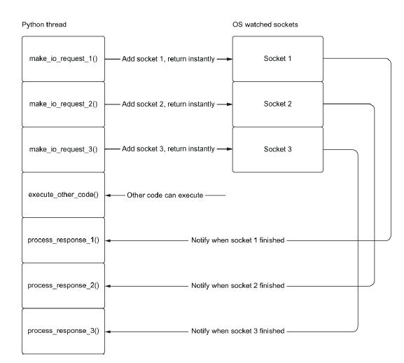

---

### 🚀 كيف يعمل الطلب unblocking 

إن إجراء طلب إدخال وإخراج  (**non-blocking I/O**) يعيد النتيجة على الفور ويطلب من نظام التشغيل مراقبة **المآخذ (sockets)** للحصول على البيانات. 

### 🏃‍♂️ تنفيذ الشفرة الكود الاخر
هذا يسمح بدالة **execute_other_code()** أن تعمل على الفور بدلاً من الانتظار حتى تكتمل طلبات الإدخال والإخراج. 

### ⏳ التنبيه عند الاكتمال
في وقت لاحق، يمكننا أن نتلقى تنبيهًا عند اكتمال الإدخال والإخراج ومعالجة الاستجابة.

### ❓ تتبع المهام
ولكن كيف نتتبع المهام التي تنتظر الإدخال والإخراج مقارنة بتلك التي يمكن أن تعمل بشكل طبيعي لأنها عبارة عن شفرة بايثون عادية؟ الجواب يكمن في بنية تُدعى **حلقة الأحداث (event loop)**.

---

### 🚀 كيف تعمل حلقة الأحداث

حلقة الأحداث هي قلب كل تطبيق يستخدم **asyncio**. تعتبر حلقات الأحداث نمط تصميم شائع في العديد من الأنظمة وقد وُجدت لفترة طويلة. إذا كنت قد استخدمت **JavaScript** في متصفح لإجراء طلب ويب غير متزامن، فقد أنشأت مهمة على حلقة أحداث.

### 🎨 تطبيقات واجهة المستخدم

تستخدم تطبيقات **Windows GUI** ما يُسمى بحلقات الرسائل خلف الكواليس كآلية أساسية للتعامل مع الأحداث مثل إدخال لوحة المفاتيح، مع السماح أيضًا بظهور واجهة المستخدم.

### 🔄 الحلقة الأساسية

الحلقة الأساسية بسيطة جدًا. نقوم بإنشاء قائمة انتظار تحتوي على قائمة من الأحداث أو الرسائل. ثم نكرر إلى الأبد، مع معالجة الرسائل واحدة تلو الأخرى كما تأتي إلى قائمة الانتظار. في بايثون، قد تبدو حلقة الأحداث الأساسية كما يلي:

```python
from collections import deque

messages = deque()
while True:
    if messages:
        message = messages.pop()
        process_message(message)
```

### 🗂️ حلقة الأحداث في asyncio

يمكن استخدام مصطلحات أكثر دقة لشرح المفهوم. إليك نص معدل:

---

في **asyncio**، تحتفظ حلقة الأحداث بقائمة من المهام بدلاً من الرسائل. المهام هي وحدات تنفيذية تتعلق بـ **coroutine**. يمكن أن تتوقف **coroutine** عن التنفيذ عندما تصل إلى عملية مرتبطة بالإدخال والإخراج، مما يسمح لحلقة الأحداث بتشغيل مهام أخرى لا تنتظر إكمال عمليات الإدخال والإخراج.


### 📝 إنشاء حلقة الأحداث

عند إنشاء حلقة الأحداث، نقوم بإنشاء قائمة انتظار فارغة من المهام. يمكننا بعد ذلك إضافة المهام إلى قائمة الانتظار ليتم تشغيلها. كل تكرار في حلقة الأحداث يتحقق من المهام التي تحتاج إلى التنفيذ وسيقوم بتشغيلها واحدة تلو الأخرى حتى تصل المهمة إلى عملية إدخال وإخراج. في ذلك الوقت، ستُوقف المهمة، وسنطلب من نظام التشغيل مراقبة أي مآخذ لإكمال الإدخال والإخراج. ثم نبحث عن المهمة التالية التي سيتم تشغيلها.

### 🔍 مراقبة الإدخال والإخراج

في كل تكرار من حلقة الأحداث، سنتحقق مما إذا كانت أي من عمليات الإدخال والإخراج قد اكتملت؛ إذا اكتملت، سنقوم بـ "إيقاظ" أي مهام كانت متوقفة ونعطيها الفرصة لإنهاء التنفيذ.

### 📊 التصور

يمكننا تصور ذلك كما هو موضح في الشكل المقابل: الخيط الرئيسي يرسل المهام إلى حلقة الأحداث، التي يمكنها بعد ذلك تشغيلها.

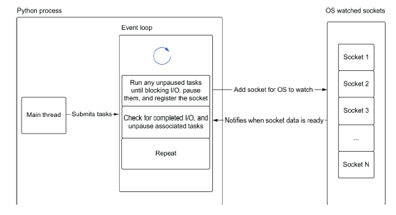


### الشكل السابق: مثال عن كيفية إرسال المهام إلى حلقة الأحداث

لتوضيح كيفية عمل **asyncio**، دعنا نتخيل أن لدينا ثلاث مهام تقوم كل منها بعمل طلب ويب غير متزامن. تتكون هذه المهام من خطوات كالتالي:

1. **إعدادات مرتبطة بالمعالجة المركزية (CPU-bound)**: جزء من الشيفرة يقوم بعمليات معالجة ثقيلة.
2. **طلب ويب غير متزامن**: يقوم بإجراء طلب بيانات من الشبكة.
3. **معالجة ما بعد الطلب (CPU-bound)**: جزء آخر من الشيفرة يعالج البيانات المستلمة.

### كود التخيلية

يمكننا كتابة الشيفرة التخيلية بالطريقة التالية:

```python
def make_request():
    cpu_bound_setup()  # إعدادات CPU-bound
    io_bound_web_request()  # طلب ويب غير متزامن
    cpu_bound_postprocess()  # معالجة البيانات المستلمة

task_one = make_request()
task_two = make_request()
task_three = make_request()
```

### سير العمل

1. **بدء المهام**: 
   - جميع المهام الثلاثة تبدأ في العمل على الإعدادات المرتبطة بالمعالجة المركزية. 
   - نظرًا لأننا نعمل في وضع أحادي thread فإن المهمة الأولى فقط هي التي تبدأ في تنفيذ code بينما تُترك المهام الأخرى في انتظار التشغيل.

2. **التوقف في انتظار الإدخال والإخراج**: 
   - بعد الانتهاء من إعدادات المعالجة، تصل المهمة 1 إلى عملية إدخال وإخراج. 
   - تتوقف المهمة 1 وتخبر النظام: "أنا في انتظار إدخال وإخراج؛ يمكن لأي مهام أخرى أن تعمل الآن."

### الانتظار المتزامن

- عندما تتوقف المهمة 1، يمكن للمهمة 2 أن تبدأ في التنفيذ.
- تبدأ المهمة 2 في العمل على إعداداتها، ثم تتوقف في انتظار الإدخال والإخراج.
- في هذه المرحلة، كل من المهمة 1 والمهمة 2 تنتظران بشكل متزامن لإكمال طلباتهما.

### بدء مهمة جديدة

- بما أن المهام 1 و2 في وضع التوقف، يمكننا الآن تشغيل المهمة 3.
- تستمر المهمة 3 حتى تصل إلى مرحلة إدخال وإخراج، ثم تتوقف أيضًا.

### استئناف التنفيذ

- بمجرد أن تنتهي المهمة 1 من انتظار إدخالها وإخراجها، يُنبّهنا نظام التشغيل أن العملية قد اكتملت.
- يمكننا الآن استئناف تنفيذ المهمة 1 بينما تستمر المهام 2 و3 في الانتظار.

### الشكل المقابل
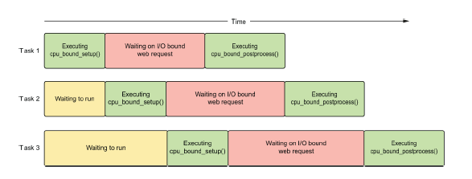
-  يمكننا رؤية تدفق تنفيذ code
- يظهر أن هناك دائمًا عمل واحد فقط مرتبط بالمعالجة المركزية قيد التشغيل، بينما يمكن أن يكون هناك عمليتان مرتبطتان بالإدخال والإخراج تعملان في نفس الوقت.
- هذه القدرة على الانتظار المتزامن هي السبب وراء تحقيق **asyncio** لوفورات كبيرة في الوقت.

---
# 2. asyncio Basics

## This chapter covers:

- The basics of `async`/`await` syntax and coroutines
- Running coroutines concurrently with tasks
- Canceling tasks
- Manually creating the event loop
- Measuring a coroutine’s execution time
- Keeping eyes open for problems when running coroutines
Chapter 1 dived into concurrency, looking at how we can achieve it with both processes and threads. We also explored how we could utilize non-blocking I/O and an event loop to achieve concurrency with only one thread. In this chapter, we’ll cover the basics of how to write programs using this single-threaded concurrency model with asyncio. Using the techniques in this chapter, you’ll be able to take long-running operations, such as web requests, database queries, and network connections and execute them in tandem. We’ll learn more about the coroutine construct and how to use async await syntax to define and run coroutines. We’ll also examine how to run coroutines concurrently by using tasks and examine the time savings we get from running concurrently by creating a reusable timer. Finally, we’ll look at common errors software engineers may make when using asyncio and how to use debug mode to spot these problems.

***

غطى الفصل الأول مفهوم  (concurrency)، واستعرض كيفية تحقيقه باستخدام كل من  (processes) و (threads). كما استكشفنا كيفية الاستفادة من إدخال/إخراج غير حاجز (non-blocking I/O) وحلقة الأحداث (event loop) لتحقيق التزامن باستخدام thread  واحد فقط. في هذا الفصل، سنغطي الأساسيات لكتابة البرامج باستخدام single-threaded concurrency model  باستخدام asyncio. باستخدام التقنيات في هذا الفصل، ستكون قادرًا على تنفيذ العمليات الطويلة مثل طلبات الويب (web requests)، استعلامات قواعد البيانات (database queries)، و (network connections) بشكل متزامن.

سنتعلم المزيد حول **بناء الكوروتين** (coroutine construct) وكيفية استخدام **صيغة async/await** (async await syntax) لتعريف وتشغيل الكوروتينات. سنتناول أيضًا كيفية تشغيل الكوروتينات بشكل متزامن باستخدام **المهام** (tasks) ونستعرض الوقت الذي نوفره من التشغيل المتزامن من خلال إنشاء ** reusable timer ** (reusable timer). وأخيرًا، سنلقي نظرة على الأخطاء الشائعة التي قد يرتكبها مهندسو البرمجيات عند استخدام **asyncio** وكيفية استخدام **وضع التصحيح** (debug mode) لاكتشاف هذه المشكلات.

## مقدمة في **الكوروتينات** (coroutines)  
فكر في الكوروتين وكأنه **دالة بايثون** (Python function) عادية ولكن بميزة إضافية تتيح له إيقاف تنفيذه مؤقتًا عند مواجهة عملية قد تستغرق بعض الوقت لإكمالها. عند اكتمال تلك العملية الطويلة، يمكننا "إيقاظ" (wake up) الكوروتين الذي تم إيقافه مؤقتًا واستكمال تنفيذ أي كود آخر في نفس الكوروتين. أثناء انتظار الكوروتين المتوقف اكتمال العملية التي أوقف من أجلها، يمكننا تشغيل كود آخر. هذا التشغيل للكود أثناء الانتظار هو ما يمنح التطبيق الخاص بنا **التزامن** (concurrency). يمكننا أيضًا تشغيل عدة عمليات تستغرق وقتًا طويلاً بشكل متزامن، مما يمنح تطبيقاتنا تحسينات كبيرة في الأداء.  

لإنشاء وإيقاف الكوروتين مؤقتًا، سنحتاج إلى تعلم استخدام **الكلمتين المفتاحيتين async و await**. الكلمة المفتاحية **async** ستتيح لنا تعريف كوروتين، بينما ستتيح لنا الكلمة المفتاحية **await** إيقاف الكوروتين مؤقتًا عند وجود عملية تستغرق وقتًا طويلاً.


Which Python version should I use?  
The code in this book assumes you are using the latest version of Python at the time of writing, which is Python 3.10. Running code with versions earlier than this may have certain API methods missing, may function differently, or may have bugs.

***

> **ملاحظة:**
> 
> يفترض الكود في هذا الكتاب أنك تستخدم **أحدث إصدار من بايثون** (Python)، وهو الإصدار **3.10** وقت كتابة هذا النص. تشغيل الكود بإصدارات أقدم قد يؤدي إلى نقص بعض **أساليب API** (API methods)، أو أن يعمل بشكل مختلف، أو يحتوي على **أخطاء** (bugs).

### **إنشاء الكوروتينات باستخدام الكلمة المفتاحية async**  
إنشاء الكوروتين أمر بسيط ولا يختلف كثيرًا عن إنشاء **دالة بايثون** (Python function) عادية. الاختلاف الوحيد هو أنه بدلاً من استخدام الكلمة المفتاحية `def`، نستخدم `async def`. تُستخدم الكلمة المفتاحية **async** لتمييز الدالة ككوروتين بدلاً من دالة بايثون عادية.

**القائمة 2.1 استخدام الكلمة المفتاحية async**  
```python
async def my_coroutine() -> None:
    print('Hello world!')
```

الكوروتين في القائمة السابقة لا يقوم بأي شيء حتى الآن بخلاف طباعة "Hello world!" ومن الجدير بالذكر أن هذا الكوروتين لا يؤدي أي عمليات طويلة الأمد؛ بل يطبع رسالتنا ويعود. هذا يعني أنه عندما نضع الكوروتين على **حلقة الأحداث** (event loop)، فإنه سينفذ على الفور لأنه لا يوجد لدينا أي إدخال/إخراج حاجز (blocking I/O)، ولا شيء يوقف التنفيذ حتى الآن.  

**هذه الصيغة بسيطة، ولكننا نخلق شيئًا مختلفًا تمامًا عن دالة بايثون العادية.** لتوضيح ذلك، دعنا ننشئ دالة تضيف واحدًا إلى عدد صحيح بالإضافة إلى كوروتين يقوم بنفس الشيء، ونقارن نتائج استدعاء كل منهما. سنستخدم أيضًا وظيفة **النوع** (type convenience function) للنظر في النوع الذي يتم إرجاعه عند استدعاء كوروتين مقارنةً باستدعاء دالتنا العادية.

لاحظ أنه عند استدعاء دالة `add_one` العادية، يتم تنفيذها على الفور وتعيد ما نتوقعه، وهو عدد صحيح آخر. ومع ذلك، عندما نستدعي `coroutine_add_one`، لا نحصل على تنفيذ الكود داخل الكوروتين. بدلاً من ذلك، نحصل على **كائن كوروتين** (coroutine object).  

هذه نقطة مهمة، حيث أن الكوروتينات لا تُنفذ عند استدعائها مباشرة. بدلاً من ذلك، نقوم بإنشاء كائن كوروتين يمكن تشغيله لاحقًا. لتشغيل الكوروتين، نحتاج إلى تشغيله بشكل صريح على **حلقة الأحداث**. فكيف يمكننا إنشاء حلقة أحداث وتشغيل الكوروتين؟  

في إصدارات بايثون الأقدم من 3.7، كان علينا إنشاء حلقة أحداث إذا لم تكن موجودة بالفعل. ومع ذلك، أضافت مكتبة **asyncio** العديد من الوظائف التي تقوم بإدارة حلقة الأحداث. هناك دالة ملائمة، `asyncio.run`، يمكننا استخدامها لتشغيل الكوروتين. يتم توضيح ذلك في القائمة التالية.
**القائمة 2.3 تشغيل كوروتين**  
```python
import asyncio

async def coroutine_add_one(number: int) -> int:
    return number + 1

result = asyncio.run(coroutine_add_one(1))
print(result)
```
سيؤدي تشغيل القائمة 2.3 إلى طباعة "2"، كما كنا نتوقع لإرجاع العدد التالي. لقد وضعنا الكوروتين بشكل صحيح على **حلقة الأحداث**، وقد قمنا بتنفيذه!  

تقوم `asyncio.run` بعدة أشياء مهمة في هذا السيناريو. أولاً، تقوم بإنشاء **حلقة أحداث** جديدة. بمجرد أن تنجح في ذلك، تأخذ أي كوروتين نمرره إليها وتشغله حتى يكتمل، مع إرجاع النتيجة. ستقوم هذه الوظيفة أيضًا بتنظيف أي شيء قد يبقى قيد التشغيل بعد انتهاء الكوروتين الرئيسي. بمجرد انتهاء كل شيء، تقوم بإغلاق حلقة الأحداث.  

ربما تكون النقطة الأكثر أهمية حول `asyncio.run` هي أنها تهدف إلى أن تكون النقطة الرئيسية للدخول إلى تطبيق **asyncio** الذي أنشأناه. تقوم بتشغيل كوروتين واحد فقط، ويجب أن تطلق هذا الكوروتين جميع جوانب تطبيقنا الأخرى. مع تقدمنا، سنستخدم هذه الوظيفة كنقطة دخول إلى معظم تطبيقاتنا. الكوروتين الذي تقوم `asyncio.run` بتنفيذه سيقوم بإنشاء وتشغيل كوروتينات أخرى تتيح لنا الاستفادة من الطبيعة المتزامنة لـ **asyncio**.

### Pausing Execution with the `await` Keyword

المثال الذي رأيناه في القائمة 2.3 لم يكن بحاجة إلى أن يكون Coroutine، حيث أنه نفذ فقط كود بايثون only non-blocking. الفائدة الحقيقية من `asyncio` هي القدرة على إيقاف التنفيذ للسماح لحلقة الأحداث (event loop) بتشغيل مهام أخرى خلال عملية طويلة الأمد. لإيقاف التنفيذ، نستخدم الكلمة المفتاحية `await`.

عادة ما تتبع الكلمة المفتاحية `await` استدعاءً لـ Coroutine (بشكل أكثر تحديدًا، كائن يُعرف باسم Awaitable، والذي ليس دائمًا Coroutine؛ سنتعرف أكثر على Awaitables لاحقًا في الفصل). 

استخدام الكلمة المفتاحية `await` سيتسبب في تشغيل الـ Coroutine التي تليها، على عكس استدعاء Coroutine مباشرة، والذي ينتج عنه كائن Coroutine. ستقوم تعبير `await` أيضًا بإيقاف الـ Coroutine حيثما تم احتواؤها حتى تنتهي الـ Coroutine التي انتظرناها وترجع نتيجة. عندما تنتهي الـ Coroutine التي انتظرناها، سنحصل على إمكانية الوصول إلى النتيجة التي أرجعتها، وستقوم الـ Coroutine المحتوية بـ "إيقاظ" لتتعامل مع النتيجة.

يمكننا استخدام الكلمة المفتاحية `await` بوضعها أمام استدعاء لـ Coroutine. من خلال توسيع برنامجنا السابق، يمكننا كتابة برنامج حيث نستدعي دالة `add_one` داخل دالة "main" غير متزامنة (async function) ونحصل على النتيجة.

### Listing 2.4 Using `await` to Wait for the Result of Coroutine

```python
import asyncio

async def add_one(number: int) -> int:
    return number + 1

async def main() -> None:
    one_plus_one = await add_one(1) ❶
    two_plus_one = await add_one(2) ❷
    print(one_plus_one)
    print(two_plus_one)

asyncio.run(main())
```

❶ Pause, and wait for the result of `add_one(1)`.  
❷ Pause, and wait for the result of `add_one(2)`.

في القائمة 2.4، نقوم بإيقاف التنفيذ مرتين. أولاً ننتظر استدعاء `add_one(1)`. بمجرد حصولنا على النتيجة، ستقوم دالة `main` بـ "إلغاء الإيقاف" وسنقوم بتعيين القيمة المرجعة من `add_one(1)` إلى المتغير `one_plus_one`، والذي في هذه الحالة سيكون اثنين. ثم نفعل نفس الشيء لـ `add_one(2)` ثم نطبع النتائج. يمكننا تصور تدفق التنفيذ لتطبيقنا، كما هو موضح في الشكل 2.1. 

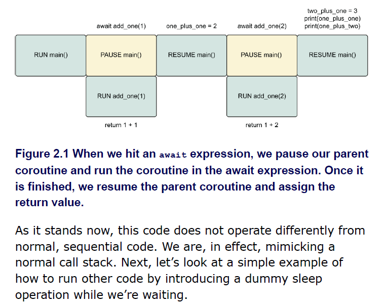


عندما نصل إلى تعبير `await`، نقوم بإيقاف الـ Coroutine الأصلية لدينا ونشغل الـ Coroutine في تعبير `await`. بمجرد الانتهاء، نستأنف الـ Coroutine الأصلية ونعين القيمة المرجعة.

كما هو الحال الآن، فإن هذا الكود لا يعمل بشكل مختلف عن الكود التسلسلي العادي. نحن، في الواقع، نقلد مكدس normal call stack. بعد ذلك، دعنا نلقي نظرة على مثال بسيط لكيفية تشغيل كود آخر من خلال إدخال عملية نوم وهمية (dummy sleep operation) بينما نحن في انتظار.

## Introducing long-running coroutines with sleep

لم تستخدم الأمثلة السابقة أي عمليات بطيئة، وكانت تهدف لمساعدتنا في تعلم بناء الجملة الأساسية لـ Coroutines. لرؤية الفوائد بالكامل ولإظهار كيف يمكننا تشغيل أحداث متعددة في وقت واحد، سنحتاج إلى إدخال بعض العمليات طويلة الأمد. بدلاً من إجراء استدعاءات API ويب أو استعلامات قاعدة بيانات على الفور، والتي تكون غير محددة بالنسبة للمدة التي ستستغرقها، سنقوم بمحاكاة العمليات طويلة الأمد من خلال تحديد المدة التي نريد الانتظار بها. سنقوم بذلك باستخدام دالة `asyncio.sleep`.

يمكننا استخدام `asyncio.sleep` لجعل Coroutine "تنام" لمدة معينة من الثواني. سيؤدي ذلك إلى إيقاف Coroutine لدينا للمدة التي نحددها، محاكيًا ما سيحدث إذا كان لدينا استدعاء طويل الأمد لقاعدة بيانات أو API ويب. `asyncio.sleep` هي بدورها Coroutine، لذا يجب علينا استخدامها مع الكلمة المفتاحية `await`. إذا استدعيناها بمفردها، سنحصل على كائن Coroutine. نظرًا لأن `asyncio.sleep` هي Coroutine، فهذا يعني أنه عندما تنتظر Coroutine أخرى لها، سيكون من الممكن تشغيل كود آخر.

لنلق نظرة على مثال بسيط، كما هو موضح في القائمة التالية، الذي ينام لمدة ثانية واحدة ثم يطبع رسالة "Hello World!".


#### القائمة 2.5 تطبيق أول مع sleep
```python
import asyncio

async def hello_world_message() -> str:
    await asyncio.sleep(1) ❶
    return 'Hello World!'

async def main() -> None:
    message = await hello_world_message() ❷
    print(message)

asyncio.run(main())
```
❶ توقف `hello_world_message` لمدة 1 ثانية.  
❷ توقف `main` حتى تنتهي `hello_world_message`.

عندما نقوم بتشغيل هذا التطبيق، سيستغرق البرنامج ثانية واحدة قبل أن يطبع رسالة "Hello World!". نظرًا لأن `hello_world_message` هي Coroutine ونوقفها لمدة 1 ثانية باستخدام `asyncio.sleep`، لدينا الآن ثانية واحدة حيث يمكننا تشغيل كود آخر بشكل متزامن.

سنستخدم sleep كثيرًا في الأمثلة القادمة، لذا دعونا نستثمر الوقت لإنشاء Coroutine قابلة لإعادة الاستخدام تنام لنا وتطبع بعض المعلومات المفيدة. سنطلق على هذه Coroutine اسم `delay`. وهذا موضح في القائمة التالية.

#### القائمة 2.6 دالة تأخير قابلة لإعادة الاستخدام
```python
import asyncio

async def delay(delay_seconds: int) -> int:
    print(f'sleeping for {delay_seconds} second(s)')
    await asyncio.sleep(delay_seconds)
    print(f'finished sleeping for {delay_seconds} second(s)')
    return delay_seconds
```


---

</div>